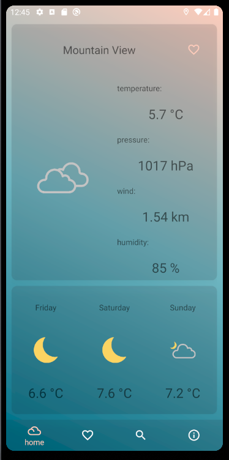
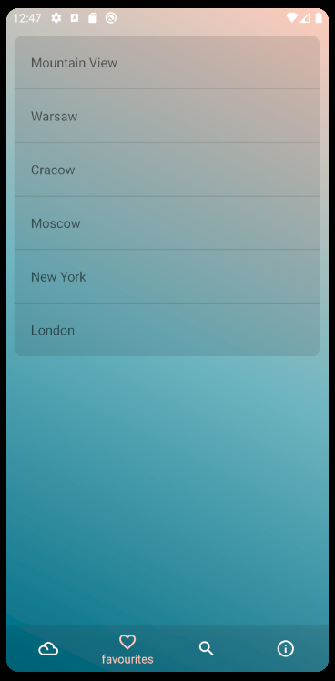
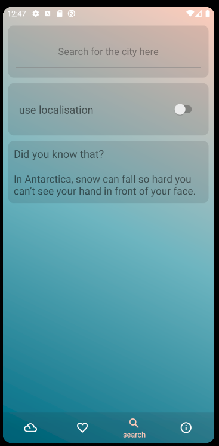

# Weather app for Android based devices
## Quick overview
This app was created as a project for High Level Languages classes at AGH university. Second Author is Karol Wnęk. Weather data is provided by OpenWeather API.

## Main screen
 

## Favourites tab.
 

## Search tab.
 

## Technology:
* retrofit2
* Gson
* fused location API
* fragments
* java
